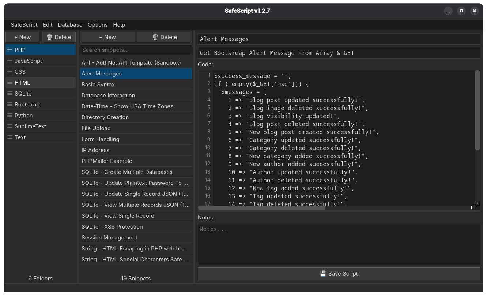
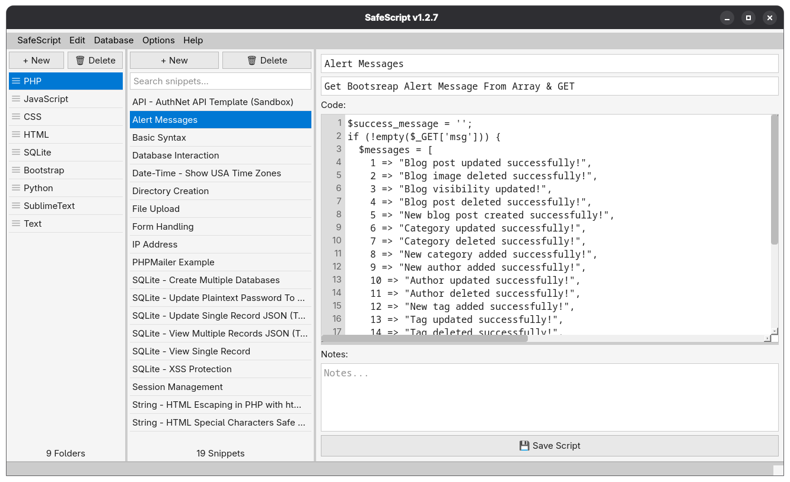

# SafeScript

A clean, fast code snippet manager for Linux built with Qt6.




## Features
- Organize snippets into folders
- Syntax-aware code editor with line numbers
- Notes field for each snippet
- Dark and light mode
- Search snippets instantly
- Data stored locally in SQLite

## Installation

### Flatpak (recommended)
```bash
flatpak install flathub com.brainscanmedia.SafeScript
```

### Build from source

Requires Qt6 with Widgets and SQL modules.
```bash
git clone https://github.com/BrainScanMedia/SafeScript.git
cd SafeScript
qmake6 SafeScript.pro
make
sudo make install
sudo gtk-update-icon-cache -f /usr/share/icons/hicolor/
```

This installs the binary, desktop entry, icon, and metainfo system-wide so SafeScript appears in your app launcher with its icon.

To uninstall:
```bash
sudo rm /usr/local/bin/SafeScript
sudo rm /usr/local/share/applications/safescript.desktop
sudo rm /usr/share/icons/hicolor/256x256/apps/safescript.png
sudo rm /usr/local/share/metainfo/com.brainscanmedia.SafeScript.metainfo.xml
sudo gtk-update-icon-cache -f /usr/share/icons/hicolor/
sudo update-desktop-database /usr/local/share/applications/
```

Then log out and back in to complete removal.

## Data Storage
Snippets are saved locally at `~/Documents/SafeScript/storage.sqlite3`.

## License
MIT — © BrainScanMedia.com, Inc.
