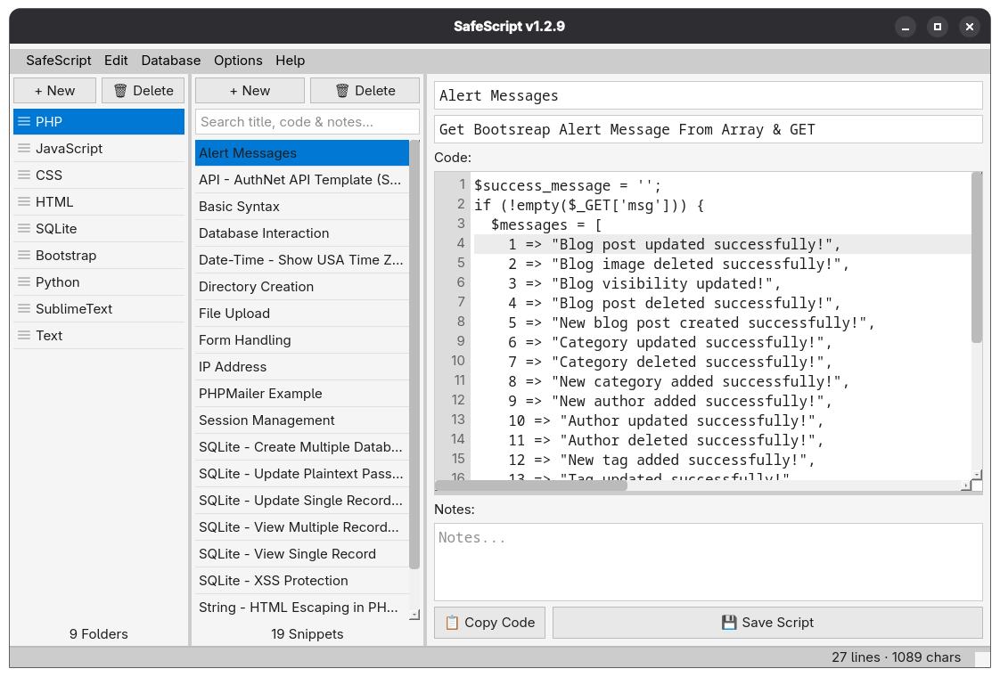
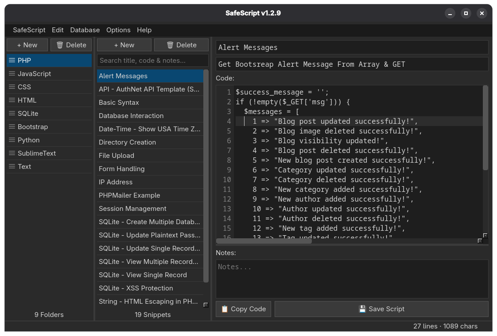

# SafeScript

A clean, fast code snippet manager for Linux built with Qt6.




## Features
- Organize snippets into folders with drag-to-reorder
- Mark snippets as favorites — they float to the top of the list
- Clone snippets, or move them between folders
- Syntax-aware code editor with optional line numbers, current-line highlight, and adjustable font size
- Notes field for each snippet
- One-click **Copy Code**, plus **Find & Replace** within a snippet
- Instant search across snippet titles, code, and notes
- Drag a file onto the window to turn it into a snippet
- Export a single snippet, or a whole folder, to files
- Status bar showing line and character counts and when a snippet was last modified
- Warns before discarding unsaved edits
- Dark and light mode
- Backup your database to any location, and import one to restore or migrate
- Remembers your layout — window size, column widths, and the code/notes divider
- Reopens the last folder and snippet you were working on
- Data stored locally in SQLite — nothing leaves your device

## Keyboard Shortcuts

| Shortcut | Action |
| --- | --- |
| `Ctrl+N` | New snippet in the selected folder |
| `Ctrl+S` | Save the current snippet |
| `Ctrl+Shift+C` | Copy the current snippet's code to the clipboard |
| `Ctrl+F` | Find / Replace within the current snippet |
| `Ctrl+D` | Toggle favorite on the current snippet |
| `Ctrl+Shift+D` | Clone the current snippet |
| `Ctrl+=` / `Ctrl+-` / `Ctrl+0` | Increase / decrease / reset editor font size |
| `Ctrl+X` / `Ctrl+C` / `Ctrl+V` | Cut / Copy / Paste |
| `Ctrl+A` | Select all |
| `Ctrl+Q` | Quit |

## Working with Snippets

- **Favorites** — press `Ctrl+D`, or right-click a snippet, to favorite it. Favorites are marked with a star and sorted to the top of the list.
- **Clone / Move** — right-click a snippet to clone it or move it to another folder.
- **Find & Replace** — press `Ctrl+F` inside a snippet to search and replace within its code.
- **Search** — the search box matches snippet titles, code, and notes, not just titles.
- **Import from a file** — drag a file from your file manager onto the window to create a snippet from its contents.
- **Export** — use **Database → Export Snippet** to save the current snippet, or **Database → Export Folder** to write every snippet in a folder out to files.

## Installation

<a href='https://flathub.org/en/apps/com.brainscanmedia.SafeScript'></a>

### Flatpak (recommended)
```bash
flatpak install flathub com.brainscanmedia.SafeScript
```

### Build from source

Requires Qt6 with Widgets and SQL modules.
```bash
git clone https://github.com/BrainScanMedia/SafeScript.git
cd SafeScript
qmake6 SafeScript.pro
make
sudo make install
sudo cp safescript.png /usr/share/icons/hicolor/256x256/apps/safescript.png
sudo gtk-update-icon-cache -f /usr/share/icons/hicolor/
sudo update-desktop-database /usr/local/share/applications/
```

This installs the binary, desktop entry, icon, and metainfo system-wide so SafeScript appears in your app launcher with its icon. Log out and back in if the icon does not appear immediately.

To uninstall:
```bash
sudo rm /usr/local/bin/SafeScript
sudo rm /usr/local/share/applications/safescript.desktop
sudo rm /usr/local/share/icons/hicolor/scalable/apps/safescript.svg
sudo rm /usr/local/share/metainfo/com.brainscanmedia.SafeScript.metainfo.xml
sudo gtk-update-icon-cache -f /usr/share/icons/hicolor/
sudo update-desktop-database /usr/local/share/applications/
rm -rf ~/SafeScript
```
Then log out and back in to complete removal.

## Data Storage

Snippets are saved locally depending on how you installed SafeScript:

**Flatpak:**
`~/.var/app/com.brainscanmedia.SafeScript/data/BrainScanMedia/SafeScript/storage.sqlite3`

**Build from source:**
`~/.local/share/BrainScanMedia/SafeScript/storage.sqlite3`

### Backup and Import

Use **Database → Backup Database** to save a copy of your snippets anywhere on disk, and **Database → Import Database** to load one back in.

Importing replaces your current database entirely, so SafeScript will ask you to confirm first. The selected file is validated before anything is overwritten, and your existing data is restored automatically if the import fails.

This is also the recommended way to move your snippets between the Flatpak and source builds, since each uses its own storage location.

### Export

Use **Database → Export Snippet** to write the current snippet to a file, or **Database → Export Folder** to export every snippet in the selected folder to a directory. Unlike Backup, which produces a single database file, Export writes plain, human-readable files you can share or keep in version control.

## Preferences

The **Options** menu controls code wrapping, line numbers, dark mode, and editor font size. Your layout — window size, column widths, and the code/notes divider — is saved automatically when you exit. **Options → Reset Window Size** restores the default layout without touching your snippets.

## Developer
BrainScanMedia.com, Inc.
[https://www.brainscanmedia.com](https://www.brainscanmedia.com)

## License
MIT — © BrainScanMedia.com, Inc.
